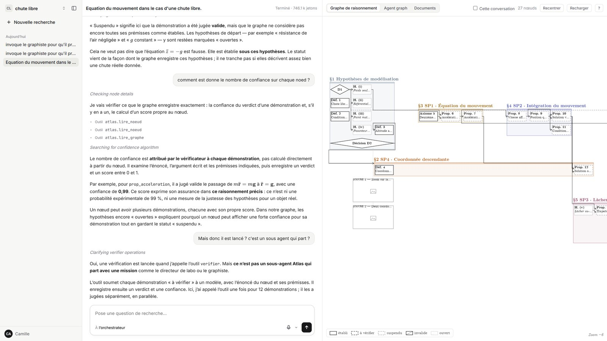
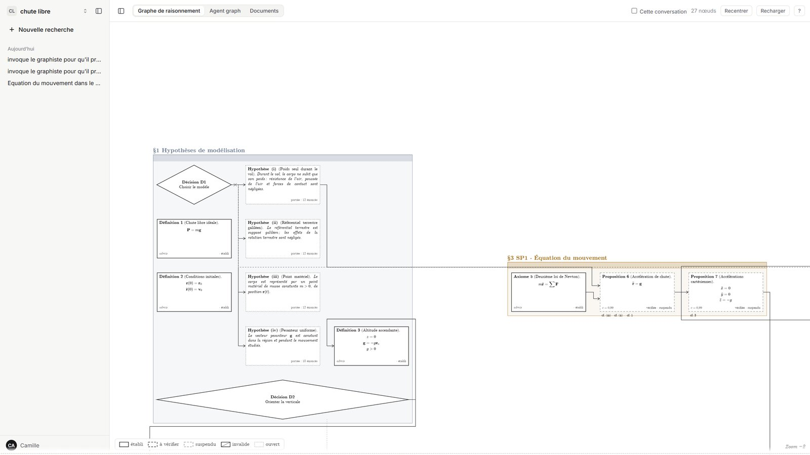
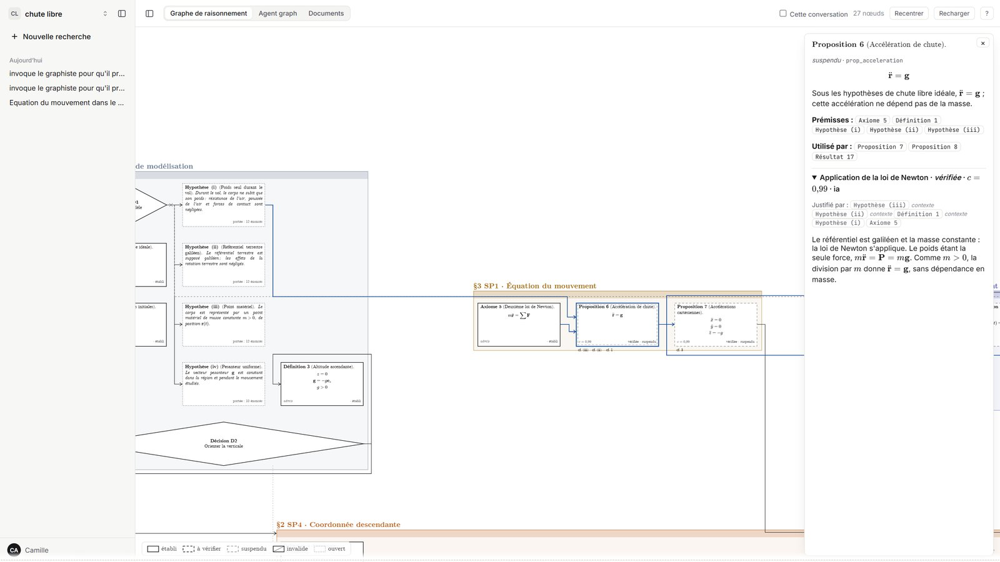
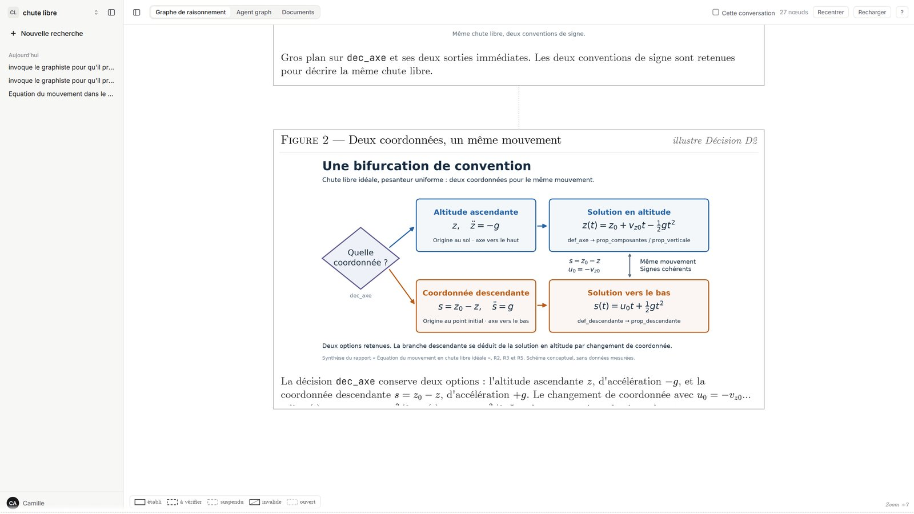
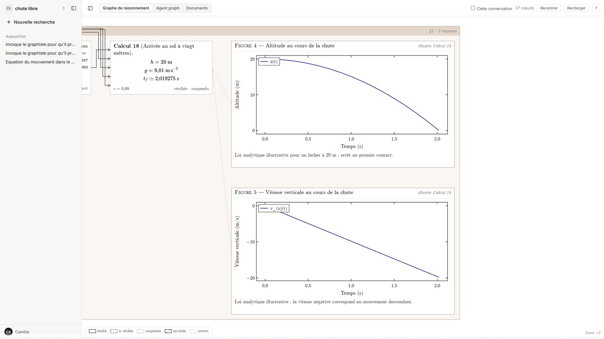
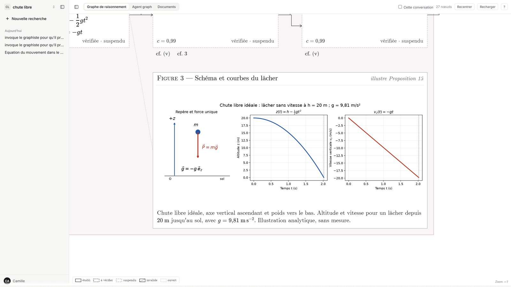
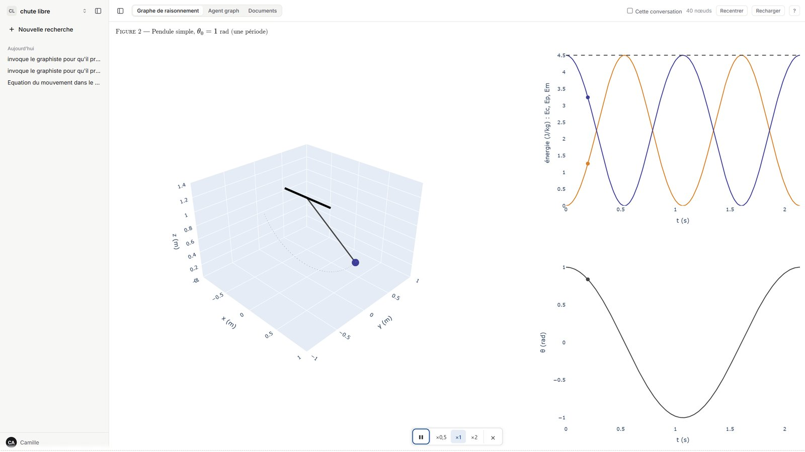
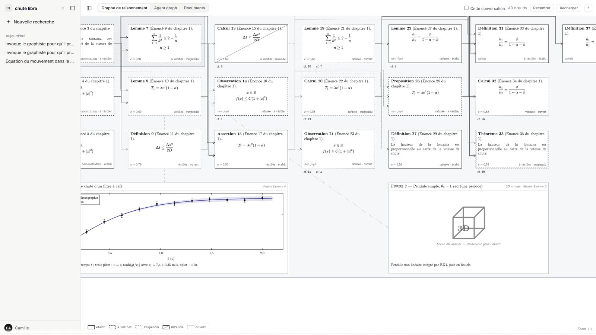
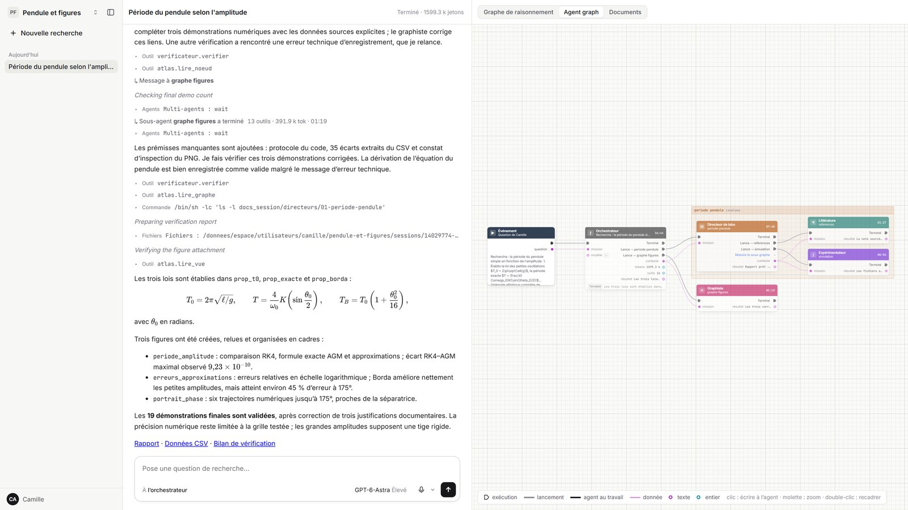
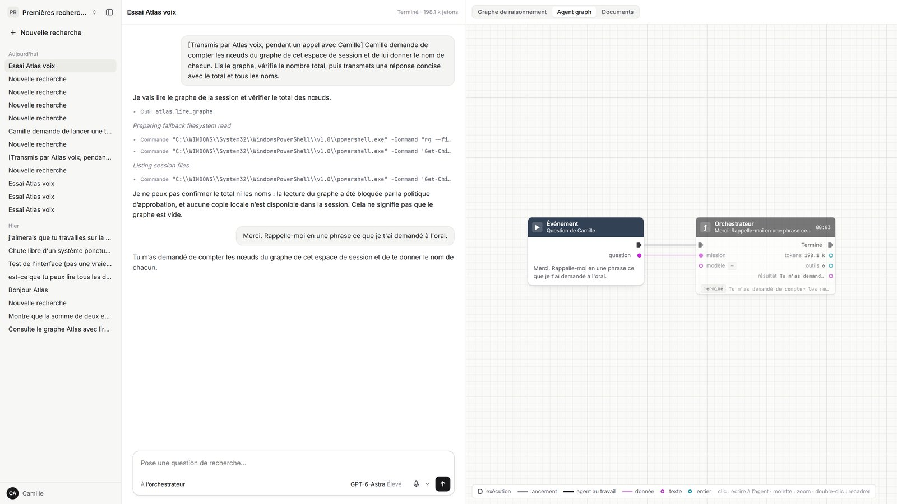

# Atlas

**Un outil pour le chercheur : il dirige une équipe d'agents IA, et leur raisonnement devient un graphe qu'il
lit, vérifie, corrige et réorganise.** Atlas ne remplace pas le chercheur : il lui donne une équipe qui travaille
sous ses yeux, et le dernier mot lui revient.

### ▶ Essayer Atlas : <https://atlas-nine-bay.vercel.app>

Rien à installer : tout tourne sur notre serveur. Le site demande un **code d'accès**, donné au jury avec le dépôt
du projet.



---

## En bref

- **Le chercheur pose une question** (« Comment la période d'un pendule dépend-elle de l'amplitude ? »).
- **Une équipe d'agents la traite sous ses yeux** : un orchestrateur confie des missions à des *directeurs de
  labo*, qui font chercher la littérature et lancer des calculs ou des simulations, puis rédigent un rapport. Le
  chercheur suit chaque agent en direct, peut écrire à n'importe lequel en cours de route pour le réorienter, ou
  l'arrêter.
- **Un *graphiste* transforme chaque rapport en graphe de raisonnement** : chaque case est un énoncé (hypothèse,
  définition, lemme, résultat, décision…), chaque flèche une démonstration qui part de ses prémisses.
- **Un vérificateur indépendant note chaque démonstration** (valide ou non, avec une confiance entre 0 et 1).
  Le statut de chaque énoncé (*établi*, *suspendu*, *invalide*…) en découle et se propage dans tout le graphe :
  on voit d'un coup d'œil ce qui tient et ce qui repose sur une hypothèse fragile.
- **Le chercheur garde la main sur le résultat** : il ouvre chaque énoncé, voit sur quoi il repose et son
  verdict, réorganise le graphe à la souris, relance les agents là où le raisonnement est faible, et peut leur
  parler à la voix. Formules LaTeX, figures (courbes, images, animations, scènes 3D) et fichiers produits sont
  tous consultables.

---

## Sommaire

1. [Essayer Atlas en 5 minutes](#essayer-atlas-en-5-minutes)
2. [Visite guidée](#visite-guidée)
3. [Comment ça marche](#comment-ça-marche)
4. [Organisation du dépôt](#organisation-du-dépôt)
5. [Équipe](#équipe)

---

## Essayer Atlas en 5 minutes

1. **Ouvrir <https://atlas-nine-bay.vercel.app>** et saisir le code d'accès. Un ordinateur avec Chrome ou Edge
   est conseillé (le graphe marche aussi sur tablette).
2. **Explorer une recherche déjà faite.** En haut à gauche, le sélecteur d'espace : choisir **« Pendule et
   figures »** ou **« chute libre »**. Le graphe de raisonnement s'affiche à droite.
   - Molette pour zoomer : de loin on voit les parties du raisonnement, de près les énoncés et leurs formules.
   - **Double-clic sur une case** : sa fiche, avec ses prémisses et le verdict du vérificateur.
   - **Double-clic sur une figure** : elle s'ouvre en grand.
   - Dans la colonne de gauche, ouvrir une session : on relit la conversation, et l'onglet **Agent graph** montre
     l'équipe d'agents qui y a travaillé.
3. **Lancer sa propre recherche.** Dans le sélecteur d'espace, **+ Nouvel espace** (un nom, puis Entrée), puis
   envoyer une question.
   Un exemple court :

   > Montre que la somme de deux entiers pairs est paire, en construisant le raisonnement dans le graphe, en peu
   > de nœuds.

   Les étapes de l'orchestrateur défilent au centre, les agents apparaissent dans **Agent graph**, puis les nœuds
   arrivent dans le graphe et sont vérifiés un à un. Une vraie question de recherche (le pendule, par exemple)
   prend de 15 à 30 minutes et mobilise plusieurs agents.
4. **Intervenir pendant qu'ils travaillent** : cliquer sur un agent dans **Agent graph** pour lui écrire, ou le
   bouton d'arrêt pour le stopper. Le bouton **micro** lance un appel vocal avec Atlas.

Le bouton **?** en haut à droite du graphe liste toutes les commandes.

---

## Visite guidée

L'écran a trois colonnes : **les espaces et leurs sessions** à gauche, **la conversation** au centre, et à droite
trois onglets : **Graphe de raisonnement**, **Agent graph** et **Documents**. Chaque *espace* a son propre graphe
et son propre dossier de fichiers ; chaque *session* est une conversation avec l'orchestrateur.

### 1. Le graphe de raisonnement



Chaque case est un **énoncé**, numéroté comme dans un article (« Hypothèse (ii) », « Proposition 6 »,
« Définition 3 »). Les flèches vont des **prémisses** vers ce qu'elles démontrent ; les prémisses secondaires
apparaissent en renvoi (« cf. 3 ») pour ne pas surcharger le dessin. Les **cadres** colorés (§1, §2…) regroupent
les énoncés d'une même partie du raisonnement ; on peut les réduire en un seul bloc.

Le contour d'une case dit son **statut**, recalculé à partir de tout le graphe :

| Contour | Statut | Signification |
|---|---|---|
| plein | **établi** | admis, ou démontré de façon valide à partir de prémisses toutes établies |
| tirets | **à vérifier** | une démonstration existe mais n'a pas encore été jugée |
| tirets espacés | **suspendu** | la démonstration est valide, mais une prémisse n'est pas (encore) établie |
| barré | **invalide** | le vérificateur a rejeté la démonstration |
| pointillés | **ouvert** | aucune démonstration pour l'instant (hypothèse de travail, conjecture) |

Le zoom change le niveau de détail : de loin, des carrés colorés et les titres des cadres ; de près, les formules
et le texte complet.

**Se déplacer** : glisser le fond comme une carte, molette pour zoomer, `0` pour tout cadrer, `F` pour cadrer la
sélection. **Réorganiser** : glisser un nœud (il se range case par case), `C` pour créer un cadre autour de la
sélection, clic droit pour le menu, `Ctrl+Z` pour annuler. La case **Cette conversation** n'affiche que les nœuds
créés par la session ouverte.

### 2. La fiche d'un énoncé et son verdict



Un **double-clic** sur une case ouvre sa fiche : l'énoncé complet, ses prémisses et les énoncés qui l'utilisent
(cliquables), puis chaque démonstration avec son **verdict** (« vérifiée · c = 0,99 ») et le rôle de chaque
prémisse (principale, auxiliaire, technique, contexte). Le verdict vient du vérificateur : un premier modèle
juge chaque démonstration ; si elle est jugée invalide ou avec une confiance trop faible, un second modèle plus
puissant la rejuge et c'est son avis qui compte.

### 3. Les décisions



Quand un raisonnement fait un **choix** (quel modèle, quelle convention, quelle méthode), le graphiste le pose
comme un nœud *décision*, dessiné en losange : sa fiche donne la question, les options et les raisons du choix, et
des flèches partent vers la branche de chaque option. Le chercheur voit ainsi où le raisonnement aurait pu
bifurquer, et peut demander d'explorer l'autre branche.

### 4. Les figures



Un énoncé peut porter des **figures**, placées à côté de lui et reliées par un pointillé. Elles sont soit
**vectorielles** (mesures avec barres d'erreur, courbes, lois tracées avec leur bande d'incertitude, rendues
comme dans un article LaTeX), soit des **images** produites par les agents (schémas, graphiques matplotlib,
diagrammes Graphviz, GIF et WebP animés joués dans le graphe). Double-clic pour l'ouvrir en grand.



### 5. Les figures 3D animées



Un agent peut aussi produire une **scène 3D animée** (Plotly) : Atlas exécute son script à part (sans secrets,
durée bornée), vérifie la scène et la range comme une figure. Dans le graphe, elle apparaît comme une case
marquée d'un cube « 3D » ; **double-cliquer** fait plonger la caméra dans la scène, qui tourne en boucle (vitesse
×0,5 / ×1 / ×2, glisser pour tourner autour), avec ses graphiques 2D synchronisés à côté.



Cette fonction est terminée sur la branche `visu/figures-3d` mais pas encore en ligne sur le site.

### 6. Les agents au travail



L'onglet **Agent graph** montre en direct qui fait quoi : la question, l'orchestrateur, les directeurs de labo
qu'il a lancés et leurs propres sous-agents (littérature, expérimentateur), le graphiste. Chaque bloc donne son
état, sa durée, ses jetons et son résultat. **Cliquer sur un agent** en fait le destinataire de la saisie : le
message lui est transmis pendant qu'il travaille. Le bouton d'arrêt stoppe tout, ou un seul agent.

Au centre, la conversation affiche la réponse de l'orchestrateur (Markdown et LaTeX), ses étapes et chacun de
ses appels d'outils, dépliables. Le sélecteur sous la saisie choisit le modèle et l'effort de raisonnement.

### 7. Les documents

L'onglet **Documents** montre le dossier de l'espace : rapports et journaux des directeurs de labo, scripts,
données CSV, figures, PDF, avec un aperçu de chaque fichier. Tout ce que les agents ont produit reste
consultable par le chercheur.

### 8. Parler à Atlas



Le bouton **micro** de la saisie ouvre un appel avec **Atlas voix**. On parle en continu, on peut lui couper la
parole ; elle confie les recherches à l'orchestrateur, annonce ses étapes clés dans les silences, et peut piloter
l'écran du graphe (« montre-moi le lemme 7 », « vue d'ensemble »). Au raccrochage, la transcription est jointe au
prochain message de la conversation.

---

## Comment ça marche

```
Question ─► Orchestrateur ─┬─► Directeur de labo ─┬─► Littérature      (sources, état de l'art)
                           │   (journal, rapport)  └─► Expérimentateur  (code, simulations, figures)
                           ├─► Graphiste           rapport ─► nœuds, démonstrations, cadres, figures
                           ├─► Vérificateur        note chaque démonstration (validité, confiance)
                           └─► Réponse au chercheur
```

- **Agents** : [Codex](https://github.com/openai/codex) piloté par son SDK Python, un thread par conversation,
  sous-agents natifs de Codex. Rôles, modèles et efforts dans `atlas/orchestrateur/sous_agents.py`, consignes de
  chaque agent dans `atlas/orchestrateur/prompts/`.
- **Outils** : les agents lisent et écrivent le graphe par un serveur MCP (`atlas/orchestrateur/mcp_atlas.py`) ;
  chaque écriture est journalisée. Chaque conversation travaille dans son propre dossier.
- **Graphe** : stocké dans Supabase (Postgres). Le statut des nœuds n'est jamais stocké, il est recalculé à
  chaque lecture (`atlas/graphe.py`) ; un cycle de démonstrations ne peut pas s'auto-valider.
- **Interface** : TypeScript sans framework (Vite), graphe dessiné sur canevas avec KaTeX.
- **Voix** : transcription et synthèse Gradium en direct, cerveau Codex rapide (`atlas/voix/`).
- **Hébergement** : le site sur Vercel, les agents sur notre serveur (VM Hetzner, Docker, HTTPS par Caddy),
  Supabase entre les deux.

Référence complète (routes de l'API, modèle de données, bunker des agents, voix) :
[`docs/technique.md`](docs/technique.md).

---

## Organisation du dépôt

| Dossier | Contenu |
|---|---|
| `atlas/` | cœur Python : modèles, calcul des statuts, lecture et écriture du graphe, vue, figures |
| `atlas/orchestrateur/` | agents Codex, prompts, serveurs MCP, vérificateur |
| `atlas/voix/` | Atlas voix (appel vocal) |
| `atlas/serveur.py` | serveur complet (lecture, conversations, agents) |
| `api/index.py` | API en lecture seule, déployée sur Vercel |
| `frontend/` | interface web |
| `supabase/` | schéma (`migrations/`) et données de démonstration (`seed.sql`) |
| `tests/` | tests Python, sans réseau |
| `deploiement/` | déploiement de notre serveur (Docker, Caddy) |
| `film/` | film de présentation (Remotion), voir `film/README.md` |
| `docs/` | référence technique, captures |

---

## Équipe

*(noms à compléter)*
