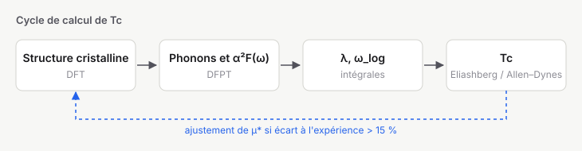

# Rapport — Domaine de validité de la formule d'Allen–Dynes

## Conclusion

La formule d'Allen–Dynes reste à moins de **10 %** des équations d'Eliashberg tant que $\lambda \le 2{,}5$.
Au-delà, elle sous-estime $T_c$ : l'écart atteint 22 % pour $\lambda = 4$.

## Démarche

Les équations d'Eliashberg isotropes sur l'axe imaginaire :

$$
Z(i\omega_n)\,\Delta(i\omega_n) = \pi T \sum_m \left[\lambda(\omega_n-\omega_m) - \mu^*\right]\frac{\Delta(i\omega_m)}{\sqrt{\omega_m^2+\Delta^2(i\omega_m)}}
$$

sont résolues pour un spectre d'Einstein $\alpha^2F(\omega) = \tfrac{\lambda\,\Omega}{2}\,\delta(\omega-\Omega)$.

## Ce qui reste ouvert

- Effet d'un spectre à deux pics (modes H et modes lourds).
