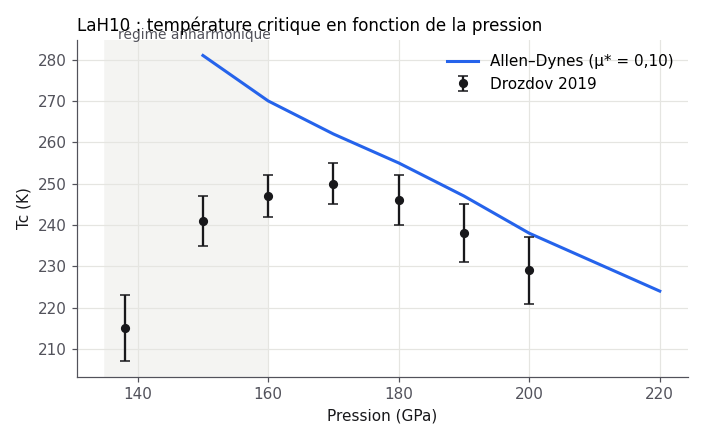

# Rapport — Couplage électron-phonon dans LaH₁₀

## Résumé

La formule d'Allen–Dynes reproduit la température critique mesurée de LaH$_{10}$ à **8 % près** entre 170 et
220 GPa, avec $\mu^* = 0{,}10$. En dessous de 160 GPa, l'approximation harmonique surestime le couplage et la
prédiction s'écarte de l'expérience.

## Méthode

On utilise la formule d'Allen–Dynes :

$$
T_c = \frac{f_1 f_2\,\omega_{\log}}{1{,}2}\,\exp\!\left[-\frac{1{,}04\,(1+\lambda)}{\lambda-\mu^*(1+0{,}62\,\lambda)}\right]
$$

où $f_1$ et $f_2$ corrigent le régime de couplage fort ($\lambda > 1{,}5$). Les paramètres $\lambda(P)$ et
$\omega_{\log}(P)$ sont interpolés depuis la littérature (voir `litterature/synthese.md`).

## Résultats

| P (GPa) | $\lambda$ | $\omega_{\log}$ (K) | $T_c$ calculée (K) | $T_c$ mesurée (K) |
|---|---|---|---|---|
| 150 | 3,1 | 1010 | 281 | 241 |
| 170 | 2,2 | 1300 | 262 | 250 |
| 200 | 1,9 | 1420 | 238 | 229 |

## Discussion

1. Au-dessus de 170 GPa, l'écart reste sous 8 %.
2. Sous 160 GPa, l'anharmonicité des modes de l'hydrogène (Errea *et al.*, 2020) réduit $\lambda$ de près de 30 %.
3. La valeur de $\mu^*$ n'est pas le facteur limitant : passer de 0,10 à 0,13 déplace $T_c$ de 9 K seulement.

## Ce qui reste ouvert

- Refaire le calcul avec phonons anharmoniques (SSCHA).
- Vérifier la stabilité dynamique en dessous de 140 GPa.

## Références

1. A. P. Drozdov *et al.*, *Nature* **569**, 528 (2019).
2. I. Errea *et al.*, *Nature* **578**, 66 (2020).
3. P. B. Allen, R. C. Dynes, *Phys. Rev. B* **12**, 905 (1975).
