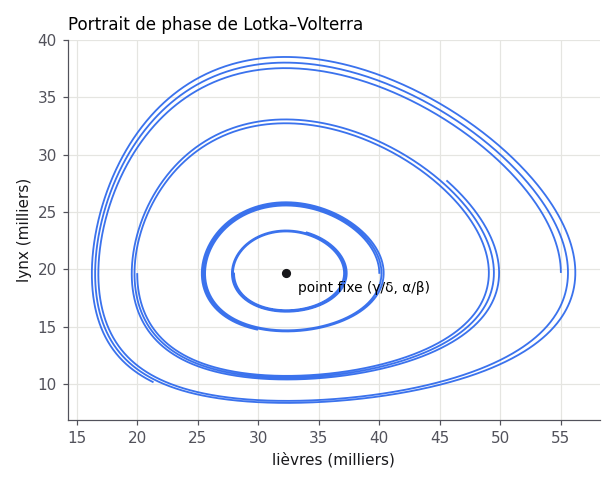

# Rapport — Stabilité du point fixe de Lotka–Volterra

## Modèle

$$
\dot{x} = \alpha x - \beta x y, \qquad \dot{y} = \delta x y - \gamma y
$$

Le point fixe intérieur est $(x^*, y^*) = (\gamma/\delta,\ \alpha/\beta)$.

## Analyse linéaire

La jacobienne en $(x^*, y^*)$ vaut

$$
J = \begin{pmatrix} 0 & -\beta\gamma/\delta \\ \alpha\delta/\beta & 0 \end{pmatrix},
$$

de valeurs propres $\pm i\sqrt{\alpha\gamma}$. Le point fixe est un **centre** : l'analyse linéaire ne conclut pas
seule, mais l'intégrale première $V(x,y) = \delta x - \gamma\ln x + \beta y - \alpha \ln y$ montre que les orbites
sont fermées. Stabilité **neutre**, pas asymptotique.

## Ajustement aux données d'Hudson

| Paramètre | Valeur |
|---|---|
| $\alpha$ | 0,55 an⁻¹ |
| $\beta$ | 0,028 |
| $\delta$ | 0,026 |
| $\gamma$ | 0,84 an⁻¹ |

Période prédite $2\pi/\sqrt{\alpha\gamma} \approx 9{,}2$ ans ; observée ≈ 10 ans.

## Ce qui reste ouvert

- Ajouter une capacité de charge : le centre devient un foyer stable.
