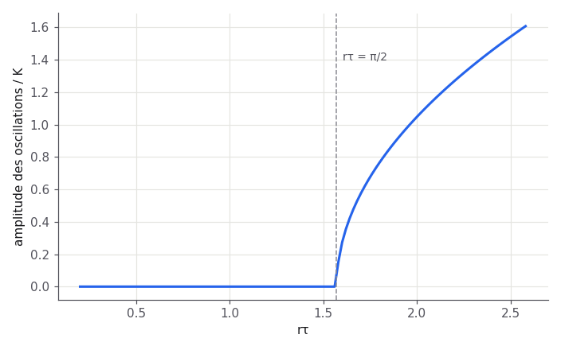

# Rapport — Équation logistique retardée

$$
\dot{N}(t) = r\,N(t)\left(1 - \frac{N(t-\tau)}{K}\right)
$$

La linéarisation autour de $N = K$ donne l'équation caractéristique $\lambda + r e^{-\lambda\tau} = 0$.
Une paire de racines traverse l'axe imaginaire pour $r\tau = \pi/2$ : **bifurcation de Hopf**.

