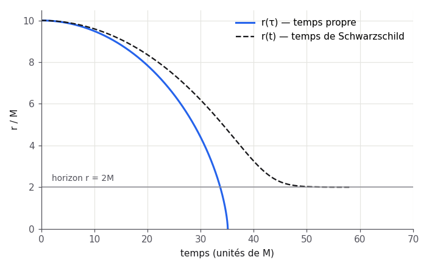

# Rapport — Temps propre de chute radiale

## Résultat

Pour un corps lâché au repos en $r_0$, la solution paramétrique en cycloïde donne

$$
r = \frac{r_0}{2}\,(1+\cos\eta), \qquad \tau = \sqrt{\frac{r_0^3}{8M}}\,(\eta + \sin\eta).
$$

Avec $r_0 = 10M$ :

- horizon ($r = 2M$) franchi à $\tau_H \approx 33{,}7\,M$ ;
- singularité atteinte à $\tau_S = \pi\sqrt{r_0^3/8M} \approx 35{,}1\,M$.

Le temps de coordonnée $t$ diverge logarithmiquement à l'approche de l'horizon :
$t \sim -2M \ln(r - 2M)$.

## Ce qui reste ouvert

- Cas d'un lâcher avec vitesse initiale non nulle.
